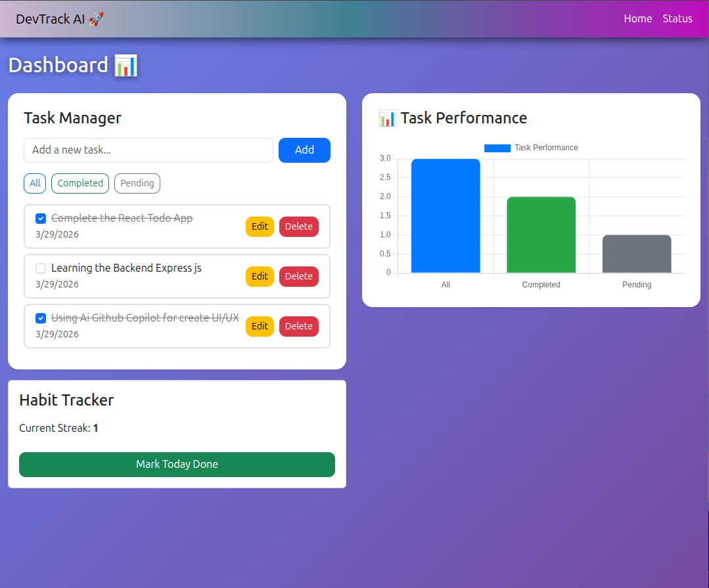
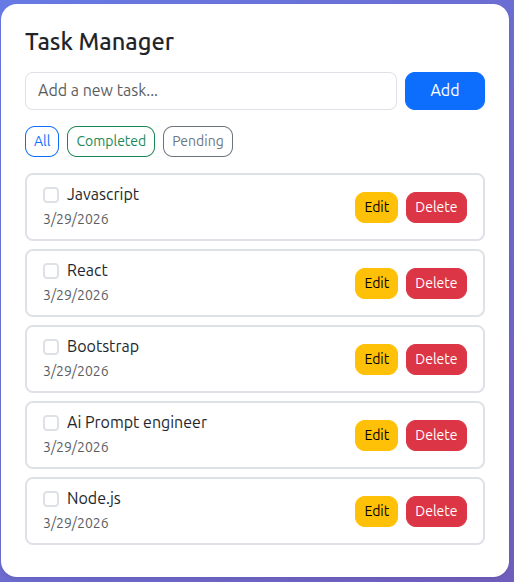
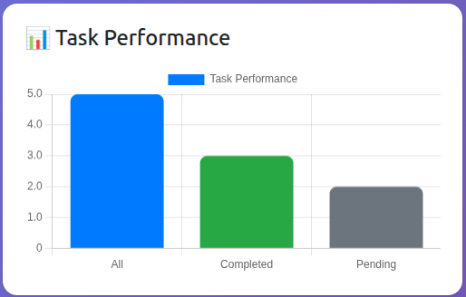

🚀 DevTrack AI – Smart Learning & Habit Tracker for Developers | React SPA with task management, productivity tracking, real-time charts, and modern UI

🏠 Dashboard


✅ Task Manager


📊 Performance Chart


## ✨ Features

* ✅ Task Management (Add / Edit / Delete)
* ✅ Mark tasks as Completed / Pending
* 📊 Real-time Performance Chart (All / Completed / Pending)
* 🔍 Filter Tasks (All / Completed / Pending)
* 💾 Data Persistence using LocalStorage
* ⚡ Smooth Navigation (SPA – No Page Reload)
* 🎨 Modern UI (Glassmorphism + Gradient Design)

---

## 🛠️ Tech Stack

* React (Vite)
* JavaScript (ES6+)
* Bootstrap 5
* CSS (Custom Styling + Glass UI)
* Chart.js (Data Visualization)

---

## 📂 Project Structure

```
src/
 ├── components/
 │    ├── Navbar.jsx
 │    ├── Dashboard.jsx
 │    ├── TaskManager.jsx
 │    ├── Tracker.jsx
 │
 ├── pages/
 │    ├── Home.jsx
 │
 ├── App.jsx
 ├── main.jsx
 ├── index.css
```

---

## ⚙️ Installation & Setup

### 1️⃣ Clone the repository

```
git clone https://github.com/SharadDwivedi-ai/devtrack-ai.git
```

### 2️⃣ Navigate into project

```
cd devtrack-ai
```

### 3️⃣ Install dependencies

```
npm install
```

### 4️⃣ Run development server

```
npm run dev
```

---

## 📊 How It Works

* Tasks are stored in **localStorage**
* Dashboard reads and updates tasks in real-time
* Chart dynamically shows:

  * Total tasks
  * Completed tasks
  * Pending tasks
* Filters allow quick productivity insights

---

## 🎯 Key Highlights

* 🔥 Real-time state synchronization using React Hooks
* ⚡ SPA navigation using React Router
* 📈 Data visualization with dynamic updates
* 🎨 Clean and responsive UI design

---

## 🚀 Future Improvements

* 📱 Mobile responsiveness optimization
* ☁️ Backend integration (Node.js + MongoDB)
* 🔐 Authentication system
* 📅 Weekly / Monthly analytics
* 🧠 AI-based productivity suggestions

---

## 👨‍💻 Author

**Sharad Kumar Dwivedi**
Frontend Developer (Fresher)

---
